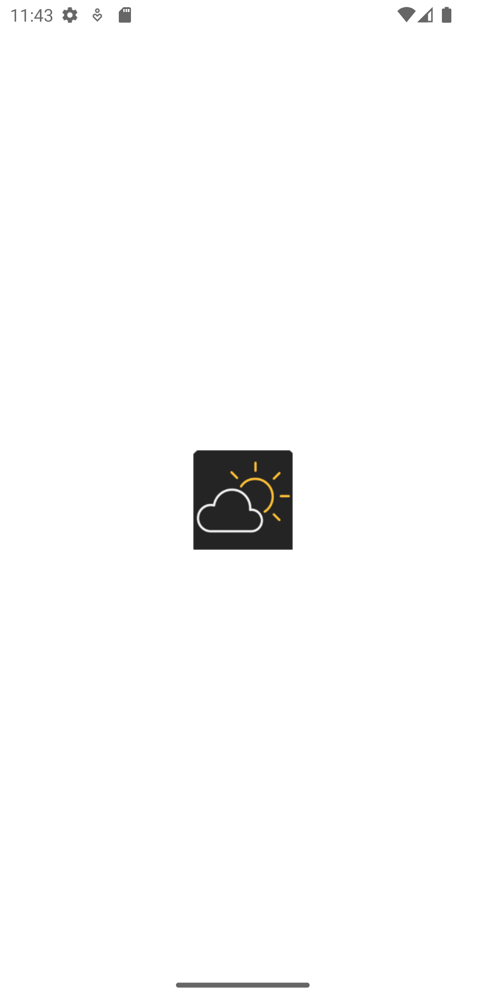
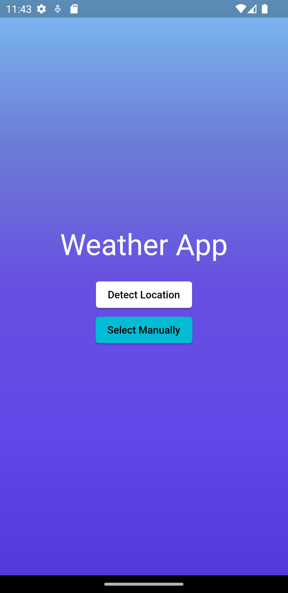
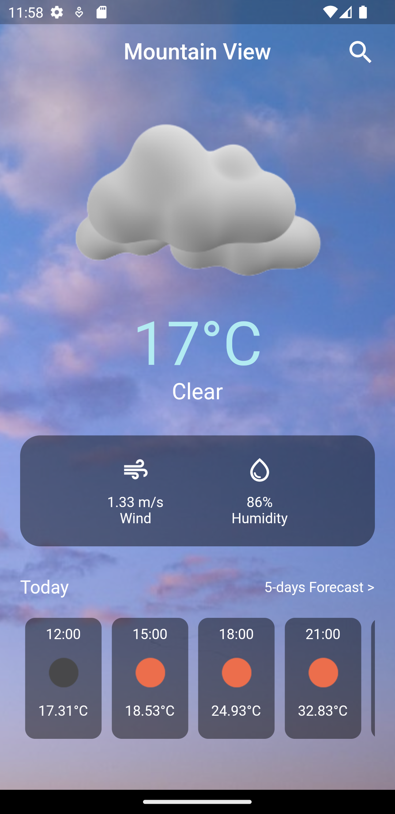

# Cloud Canvas: A Flutter Weather Application

## Introduction

This Flutter weather application is designed to provide users with current weather information in the simplest way possible. It fetches data from a OpenWeatherAPI to display the current weather details, a complete 24-hour forecast, and 5-days weather forecast. The app is built using the MVVM architecture and managed with the GetX state management library, ensuring a clean and maintainable codebase.

## Screenshots

Splash Screen                    |  Input Screen                       |  Home Screen
:-------------------------------:|:-----------------------------------:|:-----------------------------------:
     |        |  
<!-- 

 -->

## Features

- Display current weather conditions including temperature, humidity and wind speed.
- Show a comprehensive 24-hour forecast with temperature and weather conditions for each hour.
- Provide a 5-day weather forecast with daily average temperatures, humidity and wind speed with icons.
- User-friendly interface with intuitive design and smooth navigation.
- Automatic location detection or manual location input for accurate weather information.
- Error handling for API requests and network connectivity issues.

## Architecture

The app's architecture is enhanced by GetX, a state management library that simplifies reactive programming and state transitions. This design pattern separates the concerns of data, UI, and business logic, leading to a more modular and testable codebase.

## Getting Started

Follow these steps to get the app up and running (use Flutter stable release 3.10.5):

1. Clone the repository: `git clone https://github.com/Rahim47/cloud_canvas.git`
2. Navigate to the project directory: `cd cloud_canvas`
3. Recomanded for a clean start: `flutter clean` or `fvm flutter clean` if you're using Flutter Version Manager.
4. Install dependencies: `flutter pub get` or `fvm flutter pub get` if you're using Flutter Version Manager.
5. Run the app: `flutter run` or `fvm flutter run` if you're using Flutter Version Manager.

## API Integration

The app integrates with a OpenWeatherAPI to fetch weather data. The API key should be placed in the `lib/model/core/api_key.dart` file (you should create it if it doesn't exist). You can obtain an API key by signing up on the OpenWeatherAPI service's website.

## State Management

State management is handled using the GetX library. The architecture separates the app into models, views, and view models, providing a reactive and efficient way to manage application state and update the UI.

## Dependencies

- [GetX](https://pub.dev/packages/get) - State management and dependency injection.
- [Dio](https://pub.dev/packages/dio) - For making HTTP requests to the OpenWeatherAPI.
- [intl](https://pub.dev/packages/intl) - Internationalization and formatting of dates.

For a complete list of dependencies, check the `pubspec.yaml` file.

